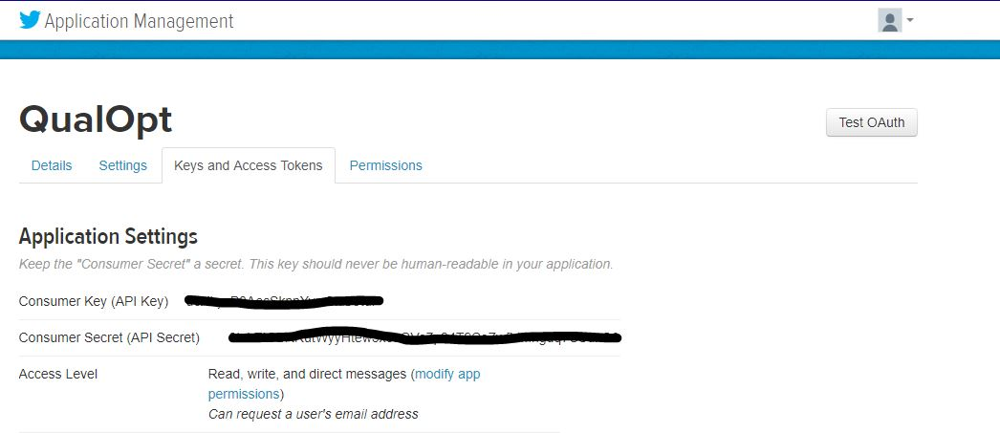

# How to Configure Spring Social App Keys and Use the Spring Social Framework in QualOpt

## Fix for [Pull Request: Added Twitter login keys #95](https://github.com/kblincoe/QualOpt_SE701/pull/95)
### Note: This markdown file is more the deployment user of QualOpt to setup Spring Social App Keys. A normal user shouln't need to do this. 

According to other contributors' requests, the person setting up or deploy QualOpt will need to register with Twitter himself/herself and obtain his/her own App keys.

1. Sign up and register at [apps.twitter.com](https://apps.twitter.com/)

2. Navigate to Twitter's Application Management page.


3. Navigate to the `Keys and Access Tokens` tab and record the Consumer Key (API Key) and Consumer Secret (API Secret).



4. Run `Setup_Spring_Social_App_Keys.bat` in the `batch_script\` directory as an administrator.

    Supply the `Consumer Key (API Key)` and `Consumer Secret (API Secret)` when prompted.

    You should expect some instructions andoutputs like this:

    ```
    C:\WINDOWS\system32>REM For QualOpt_SE701

    C:\WINDOWS\system32>REM For https://github.com/kblincoe/QualOpt_SE701/pull/95 in particular
    Enter TWITTER_CLIENT_ID:
    
    Enter TWITTER_CLIENT_SECRET:
    
    "Setting Social Environment Variables..."

    SUCCESS: Specified value was saved.

    SUCCESS: Specified value was saved.
    Press any key to continue . . .
    ```

    This is for Windows users only at the moment. The setting of envirronment variables is different for Linux and Unix users.

5. Run QualOpt according to its instructions after the setting of envirronment variables is complete.